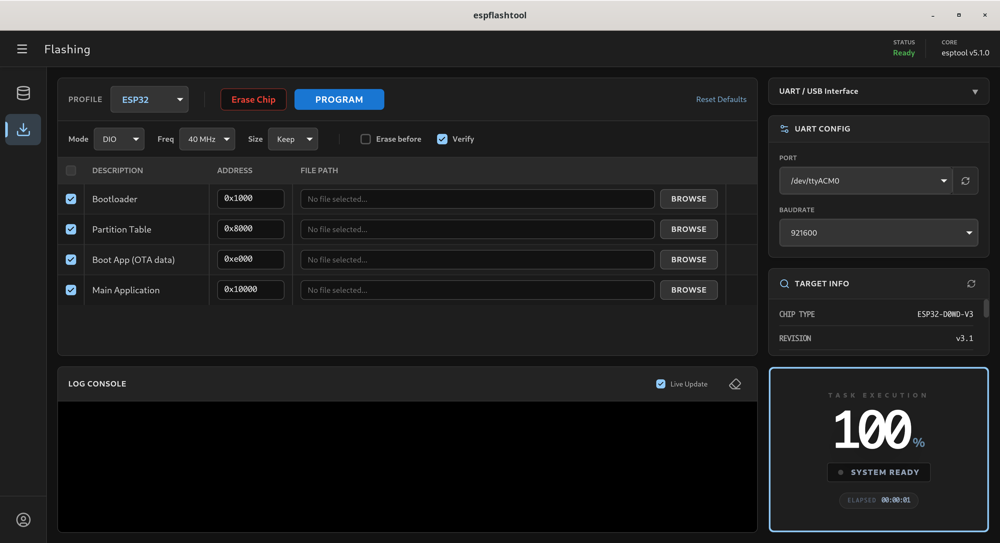
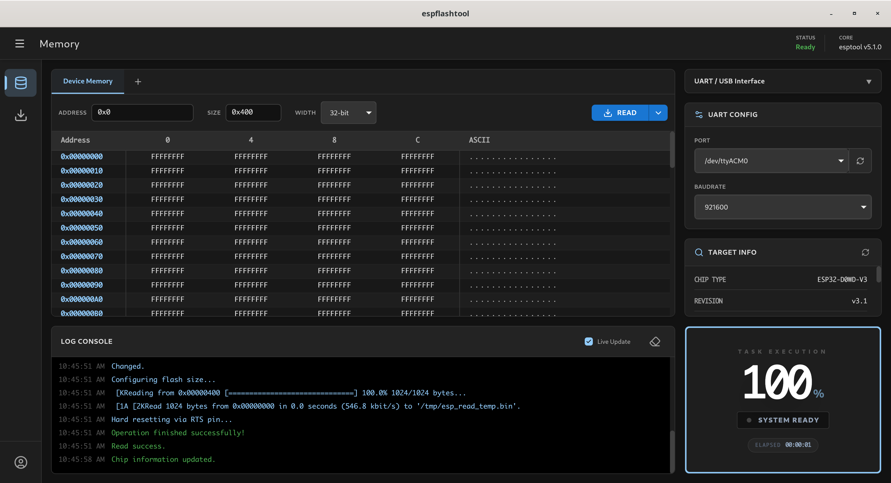

<div align="center">
  
  
</div>

<h1 align="center">EspFlash Tool</h1>

<p align="center">
  <strong>A professional, cross-platform ESP32 & ESP8266 flashing and memory exploration utility.</strong><br>
  Built with Tauri v2, Vue 3, Pinia, Tailwind CSS, and Rust.
</p>

---

## 🚀 Features

- **Modern MUI Dark Theme:** A sleek, unified dashboard layout completely devoid of distracting borders, inspired by industry-standard tools like ST-Cube Programmer.
- **ESP32 & ESP8266 Support:** Built-in profiles for standard partition layouts, along with full custom segment capabilities.
- **Real-time Execution Progress:** A gorgeous, mathematically accurate rectangular progress indicator that runs around the dashboard edge, complete with an elapsed time counter.
- **Advanced Target Parsing:** Reliably parses chip specifications directly from `esptool v5.1.0` (Chip Type, Revision, MAC Address, Crystal Frequency, and Features).
- **Hex Memory Viewer & Editor:** Read data directly from the device's flash memory or local binary files. View the data in a robust, paginated 8/16/32-bit Hex dump format.
- **Robust Persistence:** Automatically saves your port, baudrate, custom flashing addresses, and configuration settings using Pinia and LocalStorage.

## 📸 Screenshots

### Flashing Workspace
A clean, actionable workspace for erasing and programming your microcontrollers.
<div align="center">
  
</div>

### Memory Workspace
An advanced hex viewer to inspect what's inside your chip's flash memory.
<div align="center">
  
</div>

## 🛠️ Architecture

EspFlash Tool utilizes a **Feature-based** architecture, separating concerns into logical modules for extreme maintainability:
- **Frontend (Vue/Tailwind):** Housed in `src/features/` and `src/components/`, keeping logic decoupled and visually cohesive.
- **Backend (Rust):** Located in `src-tauri/src/commands/`. The backend acts as a highly reliable wrapper around Espressif's `esptool`, parsing standard output (`stdout`) and standard error (`stderr`) character-by-character to stream live progress via Tauri events to the frontend.

## ⚙️ Build Instructions

To build and run this application on your local machine:

1. **Install Dependencies:**
   Ensure you have Node.js and Rust installed on your machine.
   ```bash
   npm install
   ```

2. **Download esptool Binaries:**
   Run the setup script for your platform to fetch the necessary `esptool v5.1.0` binaries.
   - On Linux/macOS:
     ```bash
     bash scripts/download-esptool.sh
     ```
   - On Windows:
     ```powershell
     .\scripts\download-esptool.ps1
     ```

3. **Run in Development Mode:**
   ```bash
   npm run tauri dev
   ```

4. **Build for Production:**
   ```bash
   npm run tauri build
   ```

## 🤖 Acknowledgements

This project's complex UI restructuring, Rust backend integration, and codebase optimizations were developed with the assistance of an advanced AI coding agent. The AI was instrumental in enforcing strict engineering standards, squashing complex PostCSS and Rust compiler errors, and achieving the final pixel-perfect Material UI dark theme.

## 📝 License

This project is open-source and available under the MIT License.

---
<div align="center">
  <em>Developed by <strong>Dv Ngu</strong></em>
</div>
